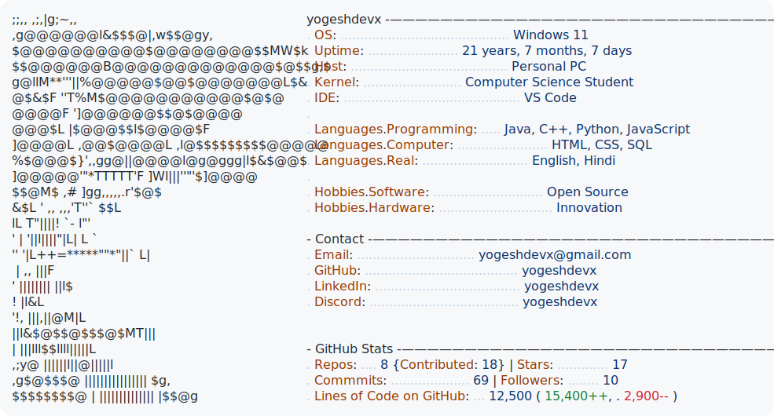

# Hi there, I'm Yogesh! 👋

  <picture>
    <source media="(prefers-color-scheme: dark)" srcset="dark_mode.svg">
    <source media="(prefers-color-scheme: light)" srcset="light_mode.svg">
    
  </picture>

---

### ⚙️ Self-Updating Profile Stats
This repository is configured with a GitHub Actions workflow that automatically:
1. Calculates my exact age/uptime since December 15, 2004.
2. Fetches my live GitHub stats (public repositories, contribution count, stars, total commits, and follower count).
3. Updates the SVG files dynamically while maintaining monospace layouts.
4. Auto-commits the updated SVGs every 12 hours.

### 🚀 Usage
To display this on your GitHub profile:
1. Create a public repository named exactly matching your GitHub username (`yogeshdevx`).
2. Push this project code to that repository.
3. The SVGs will automatically adapt to the viewer's theme (Dark Mode / Light Mode) thanks to the `<picture>` tags in this `README.md`.
